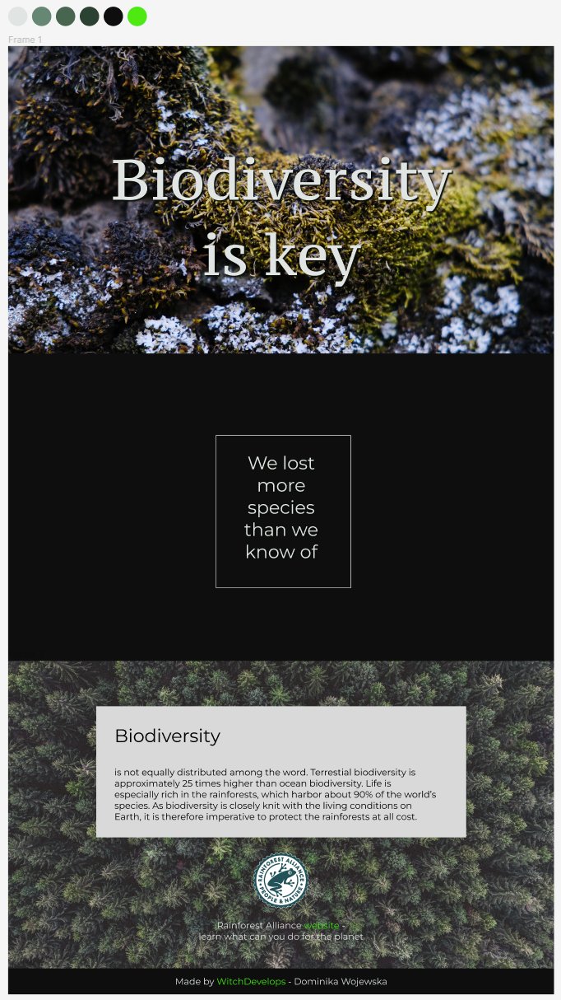

# About
This project was developed during the FreeCodeCamp web development bootcamp, based on their prompts. The design and coding are my own. For this project I designed desktop version first, then adjusted it for mobile. This was fine thanks to simplicity of the layout.

# Link
[See the project here](https://witchdevelops.github.io/biodiversity/)

# Features

This project features:
- responsive design,
- accessibility features (alt text),
- visual effects: vignette around the background images, text shadow colour, consistent color palette,
- hover and active states for links,
- custom icon for a browser tag.

# Design
[See the design file on Figma]
(https://www.figma.com/file/gaoT8fgstl15v9pUIuzwQn/Biodiversity?node-id=0%3A1)

# TO DO
Nothing, it is the final version, it is perfect ;)
